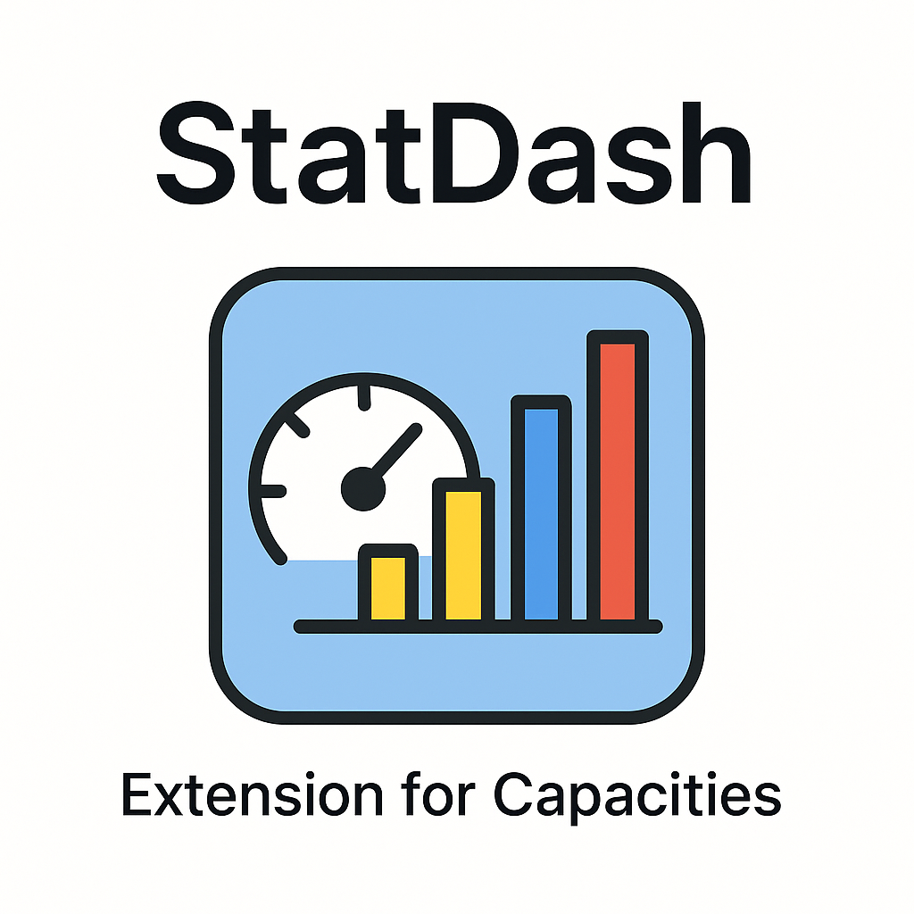

# StatDash 📊

> **A powerful statistical dashboard extension for Capacities**  
> Transform your knowledge base into actionable insights with advanced analytics, interactive charts, and comprehensive data analysis.



*StatDash provides deep analytics for your Capacities workspace, offering statistical insights, object relationship mapping, and temporal analysis through an intuitive web interface.*

## ✨ Features

### 📊 **Core Analytics**
- **Workspace Overview**: Total structures, objects, and collections
- **Top Structures**: Ranking of structures by object count
- **Interactive Charts**: Data visualizations powered by Chart.js
- **Real-time Updates**: Live data refresh and monitoring

### 🔍 **Advanced Analysis**
- **Numeric Properties**: Mean, median, standard deviation, min/max values
- **Object Relationships**: Mapping connections and dependencies
- **Temporal Activity**: Creation and modification pattern analysis
- **Structure Comparison**: Comparative analysis across different types

### 🎨 **Modern Interface**
- **Responsive Dashboard**: Modern, adaptive interface design
- **Interactive Visualizations**: Bar charts, line graphs, and statistical displays
- **Advanced Filtering**: Structure selection and analysis type filtering
- **Real-time Data**: Live updates and dynamic content loading

## 🛠️ Tech Stack

| Category | Technology |
|----------|------------|
| **Backend** | Node.js + Express |
| **Frontend** | HTML5, CSS3, Vanilla JavaScript |
| **Charts** | Chart.js + Chart.js Adapter Date-fns |
| **HTTP Client** | Axios |
| **Utilities** | Lodash, Date-fns |
| **Development** | Nodemon, Jest |

## 📋 Prerequisites

- **Node.js** 16+ 
- **Capacities API Access Token**
- **Capacities Space ID**
- **Modern web browser** (Chrome, Firefox, Safari, Edge)

## ⚙️ Installation

### 🚀 Quick Start

1. **Clone the repository**
```bash
git clone https://github.com/Sen2pi/graphAndCalc.git
cd graphAndCalc
```

2. **Install dependencies**
```bash
npm install
```

3. **Configure environment variables**
```bash
# Copy the example file
cp env.example .env

# Edit .env with your credentials
CAPACITIES_API_TOKEN=your_access_token_here
CAPACITIES_SPACE_ID=your_space_id_here
CAPACITIES_API_BASE_URL=https://api.capacities.io
PORT=3000
```

4. **Start the server**
```bash
npm start
```

### 🔧 Development Mode
```bash
npm run dev
```

## 🔑 API Setup

### 📱 Getting Your API Token

1. Open the Capacities desktop application
2. Navigate to `Settings` > `Capacities API`
3. Generate a new access token
4. **⚠️ Important**: Keep this token secure and never share it

### 🏠 Getting Your Space ID

1. In the Capacities app, go to `Settings` > `Space settings`
2. The Space ID will be displayed in the settings section

## 📡 Endpoints da API

### Dashboard Principal
- `GET /api/dashboard` - Relatório completo de análise
- `GET /api/dashboard/space-stats` - Estatísticas gerais do espaço

### Análise de Estruturas
- `GET /api/dashboard/structure/:id` - Análise completa de uma estrutura
- `GET /api/dashboard/structure/:id/numeric-properties` - Propriedades numéricas
- `GET /api/dashboard/structure/:id/references` - Análise de referências
- `GET /api/dashboard/structure/:id/temporal` - Atividade temporal

### Comparações e Coleções
- `GET /api/dashboard/compare?structureIds[]=id1&structureIds[]=id2` - Comparar estruturas
- `GET /api/dashboard/collections` - Estatísticas de coleções

### Utilitários
- `GET /health` - Verificação de saúde da API
- `GET /` - Informações da API

## 🌐 Interface Web

Acesse `http://localhost:3000/index.html` para usar a interface web completa.

### Funcionalidades da Interface
- **Dashboard principal**: Visão geral com estatísticas e gráficos
- **Seleção de estruturas**: Dropdown com todas as estruturas disponíveis
- **Tipos de análise**: Escolha entre diferentes tipos de análise
- **Gráficos interativos**: Visualizações responsivas e interativas
- **Tabelas detalhadas**: Dados organizados em tabelas para análise detalhada

## 📊 Tipos de Análise

### 1. Visão Geral
- Contagem total de objetos
- Número de propriedades numéricas
- Total de referências
- Eventos temporais

### 2. Propriedades Numéricas
- **Estatísticas descritivas**: Média, mediana, moda
- **Medidas de dispersão**: Desvio padrão, variância
- **Valores extremos**: Mínimo e máximo
- **Contagem**: Número de objetos com cada propriedade

### 3. Referências entre Objetos
- **Mapeamento de conexões**: Quais objetos referenciam outros
- **Contagem de referências**: Frequência de cada tipo de referência
- **Análise de dependências**: Objetos mais referenciados

### 4. Atividade Temporal
- **Criação de objetos**: Padrões de criação ao longo do tempo
- **Modificações**: Frequência de atualizações
- **Análise sazonal**: Padrões por dia, semana, mês

## 🔧 Desenvolvimento

### Estrutura do Projeto
```
src/
├── config/
│   └── capacities.js      # Configuração da API Capacities
├── services/
│   └── analytics.js       # Serviço de análise de dados
├── routes/
│   └── dashboard.js       # Rotas da API
└── index.js               # Servidor principal

public/
└── index.html             # Interface web

env.example                # Exemplo de variáveis de ambiente
package.json               # Dependências e scripts
README.md                  # Esta documentação
```

### Scripts Disponíveis
```bash
npm start          # Inicia o servidor
npm run dev        # Inicia em modo desenvolvimento com nodemon
npm test           # Executa os testes
```

### Adicionando Novas Funcionalidades

1. **Novos endpoints**: Adicione em `src/routes/dashboard.js`
2. **Novas análises**: Implemente em `src/services/analytics.js`
3. **Novos gráficos**: Adicione na interface web em `public/index.html`

## 📈 Exemplos de Uso

### Análise de uma Estrutura Específica
```bash
curl "http://localhost:3000/api/dashboard/structure/RootPage/numeric-properties" \
  -H "Authorization: Bearer seu_token"
```

### Comparação entre Estruturas
```bash
curl "http://localhost:3000/api/dashboard/compare?structureIds[]=RootPage&structureIds[]=RootDatabase" \
  -H "Authorization: Bearer seu_token"
```

### Estatísticas Gerais
```bash
curl "http://localhost:3000/api/dashboard/space-stats" \
  -H "Authorization: Bearer seu_token"
```

## 🚨 Limitações e Considerações

### Rate Limiting
- A API do Capacities possui limites de taxa
- Implemente retry com backoff exponencial para requisições
- Monitore os headers `RateLimit-Remaining` e `RateLimit-Reset`

### Dados em Larga Escala
- Para espaços com muitos objetos, considere implementar paginação
- Cache de resultados para melhorar performance
- Análises em background para relatórios complexos

### Segurança
- **NUNCA** exponha seu token da API no frontend
- Use HTTPS em produção
- Implemente autenticação se necessário

## 🐛 Troubleshooting

### Erro de Autenticação
```
Error: CAPACITIES_API_TOKEN é obrigatório no arquivo .env
```
**Solução**: Verifique se o arquivo `.env` existe e contém o token correto.

### Erro de Conexão
```
Error: connect ECONNREFUSED
```
**Solução**: Verifique se a API do Capacities está acessível e se o token é válido.

### Dados Não Carregam
**Solução**: 
1. Verifique o console do navegador para erros
2. Confirme se o servidor está rodando
3. Verifique as permissões do token da API

## 🤝 Contribuição

1. Fork o projeto
2. Crie uma branch para sua feature (`git checkout -b feature/AmazingFeature`)
3. Commit suas mudanças (`git commit -m 'Add some AmazingFeature'`)
4. Push para a branch (`git push origin feature/AmazingFeature`)
5. Abra um Pull Request

## 📄 Licença

Este projeto está licenciado sob a Licença MIT - veja o arquivo [LICENSE](LICENSE) para detalhes.

## 🔗 Links Úteis

- [Documentação da API Capacities](https://docs.capacities.io/developer/api)
- [Capacities Website](https://capacities.io)
- [Chart.js Documentation](https://www.chartjs.org/docs/)
- [Express.js Documentation](https://expressjs.com/)

## 📞 Suporte

Se você encontrar problemas ou tiver dúvidas:

1. Verifique esta documentação
2. Consulte os logs do servidor
3. Abra uma issue no repositório
4. Entre em contato com a equipe de desenvolvimento

---

**Desenvolvido com ❤️ para a comunidade Capacities**
